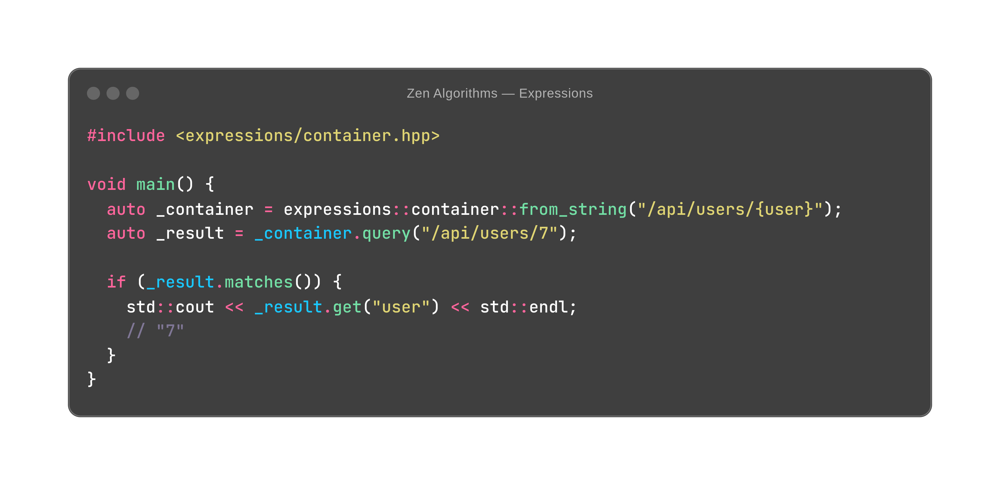

See more [examples](https://github.com/ZenAlgorithms/Expressions/blob/master/tests/implementation_test.cc) ...

## Build

```shell
git clone https://github.com/ZenAlgorithms/Expressions.git
cd Expressions
mkdir build
cd build
cmake ..
make
make install
```
